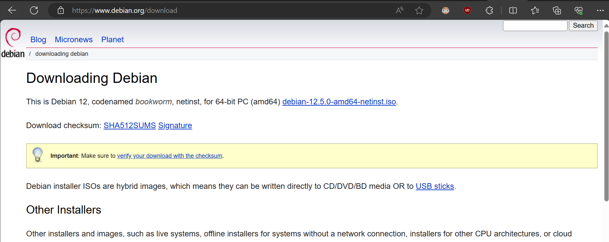
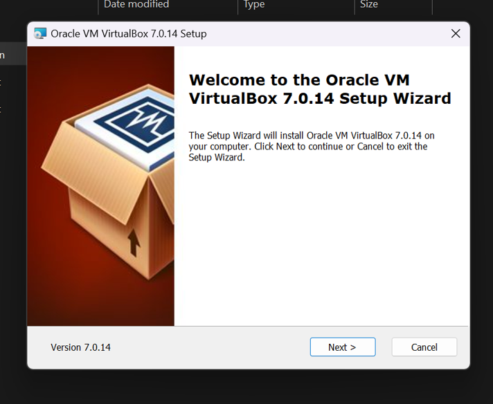
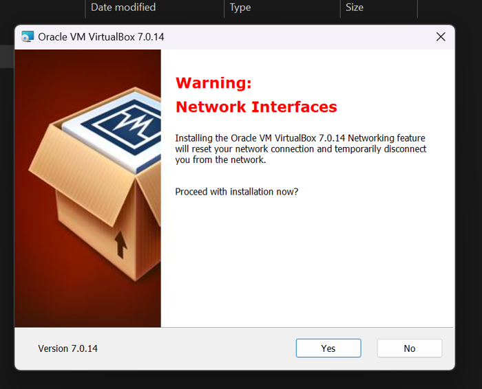
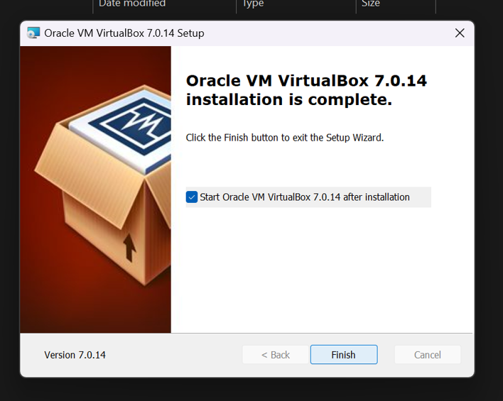
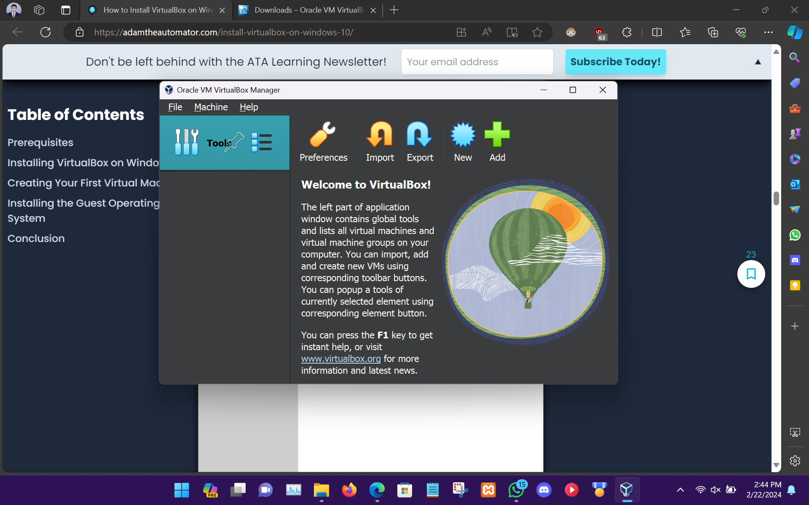
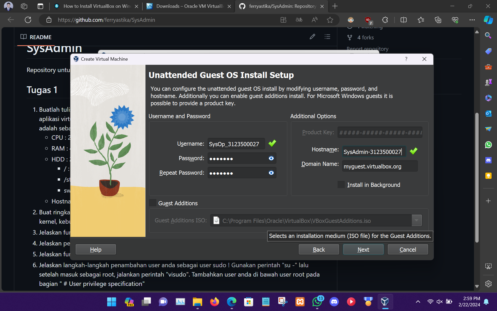
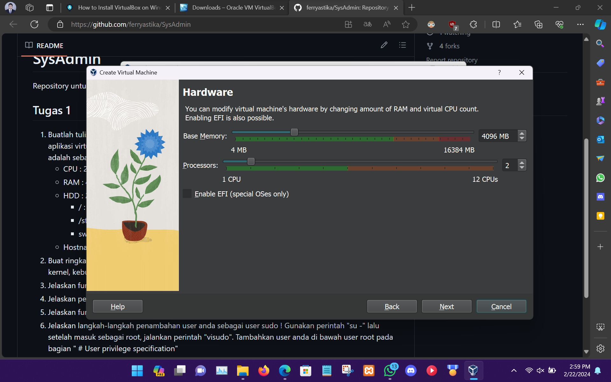
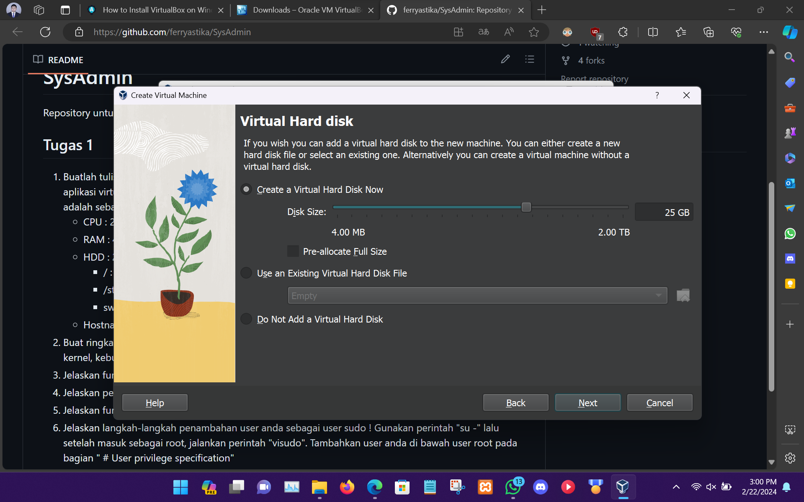

  <h1 style="text-align: center;font-weight: bold">PRAKTIKUM 1 SISTEM OPERASI</h1>
  <h4 style="text-align: center;">Dosen Pengampu : Dr. Ferry Astika Saputra, S.T., M.Sc.</h4>

 

  
  <h3 style="text-align: center;">Disusun Oleh : </h3>
  

    <strong>Marieta Nona Alfani (312350026) </strong> 
    <strong>Ale Perdana Putra Darmawan (3123500027) </strong> 
    <strong>Kanisius Keru Okok Dinggon(3123500028)</strong>
  

<h3 style="text-align: center;line-height: 1.5">Politeknik Elektronika Negeri Surabaya Departemen Teknik Informatika Dan Komputer Program Studi Teknik Informatika 2023/2024</h3>
  

## Daftar Isi
1. [Dasar Teori](#Dasar-teori)
2. [Soal](#soal)

## Dasar teori
Pengertian Sistem Operasi: 
<strong>Sistem Operasi</strong> adalah perangkat lunak pada lapisan pertama yang ditempatkan pada memori komputer pada saat komputer dinyalakan booting. Sedangkan software-software lainnya dijalankan setelah sistem operasi berjalan, dan sistem operasi akan melakukan layanan inti untuk software-software itu.

## Soal
#### Sebutkan dan jelaskan proses booting !
1 . <strong>Power ON</strong>
Saat tombol power atau tombol reset dihidupkan, sumber daya listrik akan mengalir ke komputer.
Kemudian, perangkat keras akan menerima daya untuk dinyalakan.

2 . <strong>POST (Power On Selft Test)</strong>
Setelah dinyalakan, komputer akan melakukan Power-On Self-Test atau POST, yang merupakan serangkaian tes perangkat keras untuk memastikan bahwa semuanya berfungsi dengan baik. 
POST akan memeriksa RAM, prosesor, kartu grafis, dan perangkat keras lainnya. 

3 . <strong>Inisialisasi perangkat keras</strong>
Setelah POST selesai, komputer akan menginisialisasi perangkat keras seperti hard drive, keyboard, mouse, dan perangkat lainnya. 
Proses ini melibatkan tahap mengenali perangkat keras, memuat driver yang diperlukan, dan menyiapkan perangkat untuk digunakan.

4 . <strong>Membaca sektor boot</strong>
Selanjutnya, komputer akan mencari sektor boot di hard drive atau perangkat penyimpanan lainnya. 
Sektor boot adalah area khusus yang berisi instruksi awal untuk memuat sistem operasi.

5 . <strong>Memuat Sistem Operasi</strong>
Setelah sektor boot ditemukan, komputer akan memuat sistem operasi ke dalam memori utama (RAM). 
Kemudian, sistem operasi akan mengambil alih kendali dan mulai menjalankan program-program yang diperlukan untuk mengoperasikan komputer.

#### Bagaimana cara install Oracle Virtual Box dan Debian dalam Virtual Box ?

## Instalasi Oracle Virtual Box
1. Masuk ke laman download [Oracle Virtual box](https://www.virtualbox.org/wiki/Downloads), lalu download sesuai sistem operasi yang anda gunakan.

2. Masuk ke laman Download sistem operasi [Debian](https://www.debian.org/download) untuk download sistem operasi Linux Debian.

3. Buka setup Oracle dan pilih Next.

4. Dalam menu tidak ada yang perlu diubah, pilih Next.

5. Pilih Yes.

6. Pilih Install.

7. Oracle Virtual Box telah di install, pilih finish.

## Instalasi Linux Debian dalam Oracle Virtual Box
1. Buka Oracle Virtual Box, lalu tekan opsi "New".

2. Isi nama, pilih letak penyimpanan Virtual Box, masukkan file ISO debian yang telah diunduh, klik "Skip unattended Installation, dan pilih Next.

3. Isi Username dan hostname dan ubah password, untuk domain name tidak perlu diganti, lalu pilih Next. 

4. Tentukan RAM dan jumlah CPU yang diinginkan, lalu pilih Next.

5. Tentukan ukuran storage didalam Virtual Machine, lalu pilih Next.

6. Dalam tampilan ini, anda dapat melihat ulang pilihan yang anda telah pilih sebelumnya, jika sudah sesuai keinginan, pilih Finish.

## Mengkonfigurasi Debian dalam Oracle Virtual Box
1. 

